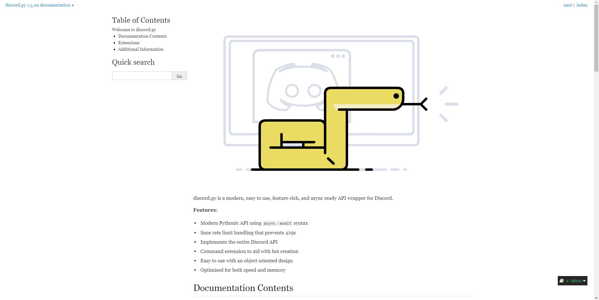
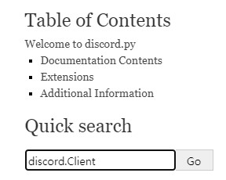
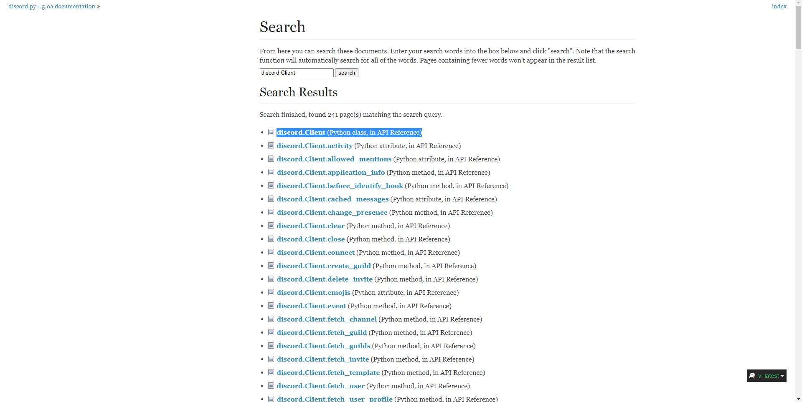

***discord.py 문서를 읽는 방법?***  
먼저 discord.py 문서를 열어봅시다.  
https://discordpy.readthedocs.io/en/latest/index.html  
https://discordpy.cpbu.xyz/index.html (번역이 진행중인 문서 - 많은 기여가 필요합니다)  

  

음... 먼저 뭘 찾아볼까요? 저는 discord.Client를 한번 찾아보죠.  
  
간단하게 Quick Search(빠른 검색)에 `discord.Client` 라고 치면 검색 결과가 많이 나오는데, 가장 위에 있는 것을 클릭하죠.  
  
